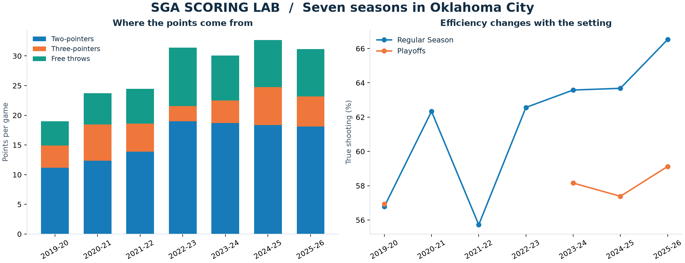
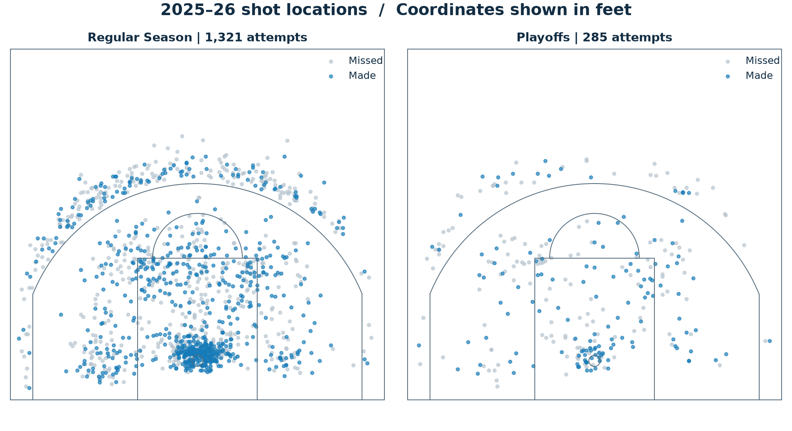
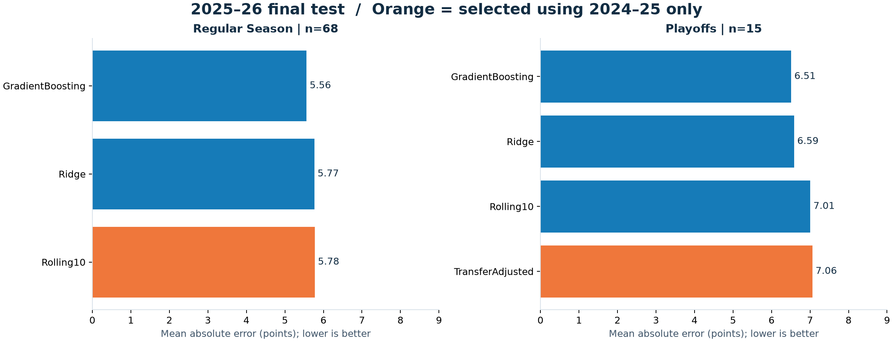
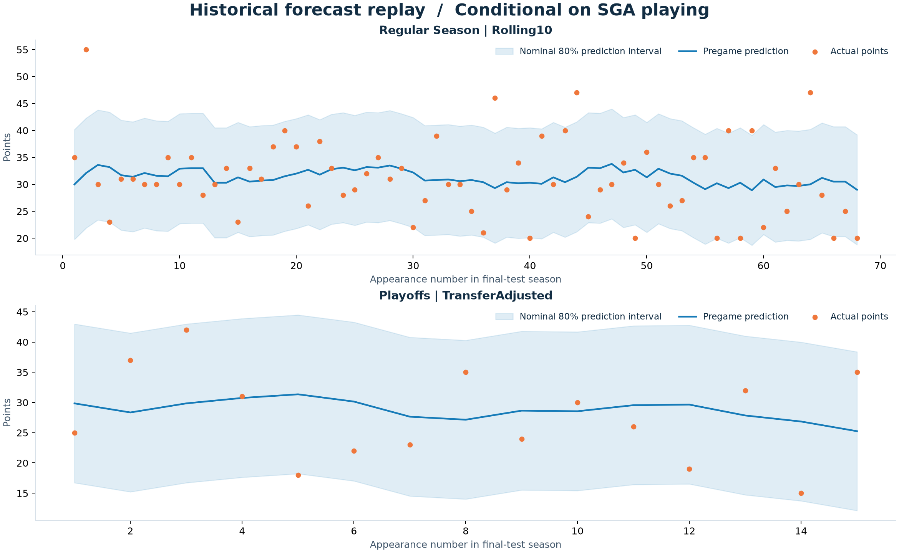

# SGA Scoring Lab

Scoring trends, shot profiles and next-appearance scoring forecasts for Shai Gilgeous-Alexander.

Built to explore how SGA scores and how much recent form tells us about his next appearance. Covers **seven Oklahoma City seasons, 2019–20 to 2025–26**, with separate regular-season and playoff analysis, a Python forecasting pipeline and a generated Tableau workbook.

**Python · pandas · scikit-learn · Tableau · NBA Stats**  
448 regular-season appearances · 55 playoff appearances · 9,580 shot attempts

## Research questions and findings

| Question | Evidence | Conclusion |
| --- | --- | --- |
| Where did scoring growth come from? | Regular-season PPG rose from 19.0 to 31.1; two-pointers contributed +6.9, free throws +3.8 and threes +1.3 points. | Two-point scoring accounts for the largest part of the observed increase. This is a scoring decomposition, not a causal explanation. |
| Did efficiency improve alongside volume? | True shooting rose from 56.8% to 66.5% between the first and last season. | Higher scoring was accompanied by better overall scoring efficiency. |
| Does the same profile carry into the playoffs? | In 2025–26, playoff PPG was 27.6 and TS was 59.1%, versus 31.1 and 66.5% in the regular season. | The latest postseason differed materially, but 15 games do not establish a general playoff effect. |
| Can machine learning improve the forecast? | The rolling ten-game average won validation. Gradient Boosting's final-test MAE was 5.56 versus the baseline's 5.78. | The final-test gain was small and uncertain; it does not justify changing the selected model after seeing test results. |

## 1. Scoring development



The rise in scoring was not driven primarily by three-pointers. Two-point scoring grew by approximately **6.9 points per game**, while free throws added **3.8**. This section decomposes the scoring increase by point source; it does not separately attribute that increase to changes in shot volume and conversion rates.

Regular-season and playoff results retain separate denominators throughout. Seasons without a playoff appearance are missing observations, not zero-point seasons.

## 2. Regular season versus playoffs



In 2025–26, midrange attempts represented **26.9%** of regular-season shots and **36.1%** of playoff shots. Midrange accuracy declined from **54.9% (195/355)** to **46.6% (48/103)**. Restricted-area attempts also fell as a share of all shots, from **27.6% to 20.0%**.

This supports a descriptive finding: the latest playoff shot profile shifted toward midrange attempts while efficiency declined. The data do not isolate the effects of opponent defense, injuries or shot difficulty.

## 3. Next-appearance scoring forecasts

The target is SGA's points in his next appearance, **conditional on playing**. Inputs include lagged scoring, minutes, attempts, efficiency, rest, venue and estimated team/opponent context. Actual game minutes and current-game outcomes are excluded from prediction inputs.

| Stage | Seasons | Purpose |
| --- | --- | --- |
| Historical training and development | 2019–20 to 2023–24 | Build past-only features; development evaluations in 2022–23 and 2023–24 |
| Validation | 2024–25 | Select models and calibrate prediction intervals |
| Final retrospective test | 2025–26 | Evaluate frozen selections on a later season |

Learned models are fitted once before each evaluation season using earlier regular-season games. Features update as games finish. Playoffs are evaluated separately, including a shrinkage adjustment estimated from earlier out-of-sample playoff errors.



| Model | Regular-season MAE, 68 games (his actual appearances in 2025–26) | Playoff MAE, 15 games |
| --- | ---: | ---: |
| Last ten appearances | **5.78 — selected** | 7.01 |
| Ridge regression | 5.77 | 6.59 |
| Gradient Boosting | 5.56 | 6.51 |
| Playoff transfer adjustment | — | **7.06 — selected** |

MAE is the average absolute error in points; it is not a guaranteed error bound. Gradient Boosting improved regular-season test MAE by approximately **0.21 points**, but the paired weekly-block bootstrap interval for its difference versus baseline crossed zero. The selected playoff adjustment failed to improve on the baseline in the final test.



The selected regular-season forecast's nominal 80% intervals covered **85.3%** of final-test outcomes, with an average total width of **20.4 points**. That width and the missed scoring outliers show why a point forecast alone understates game-level uncertainty.

## Implementation notes

- **Data quality:** reconcile every game's shot attempts and makes against box scores; preserve source hashes and acquisition/import provenance.
- **Leakage prevention:** calculate features using strictly earlier dates; test that changing current/future outcomes cannot change forecast inputs.
- **Model discipline:** benchmark learned models against recent form and select on validation rather than the best final-test score.
- **Evaluation:** report failed playoff transfer, interval width, large misses and small-sample uncertainty alongside headline metrics.

[Full findings and error analysis](reports/RESULTS.md) · [Methodology](docs/METHODOLOGY.md) · [Model card](docs/MODEL_CARD.md)

## Tableau analysis

The Python pipeline produces a native Tableau workbook with four dashboards, twelve worksheets, eleven worksheet filter definitions, three dashboard filter controls and an embedded Hyper extract:

| Dashboard | Analytical purpose |
| --- | --- |
| Regular Season | Compare scoring sources, efficiency and shot-zone profiles across seasons |
| Playoffs | Inspect series-level scoring and postseason shot locations |
| Compare Phases | Compare regular-season and playoff outcomes within the same season |
| Predictions | Inspect model errors and actual versus predicted points, with a competition filter |

The four figures above are generated by Matplotlib in `scripts/report.py`. Python computes the analytical metrics and forecasts; `scripts/build_tableau.py` packages those outputs into a Tableau workbook for visualization, filtering and standard aggregation, with no custom calculated fields or parameters.

The generated workbook and extract are excluded from version control. Run the pipeline below to produce `tableau/SGA_Scoring_Lab.twbx`, then open it in Tableau. [Workbook guide](docs/TABLEAU.md).

## Repository structure

```text
sga_lab/             Data preparation, feature engineering and model evaluation
scripts/             Acquisition, analysis, figure and Tableau builders
reports/             Findings, figures, quality checks and model-run metadata
docs/                Methods, sources, data dictionary and model card
tests/               Temporal integrity and workbook checks
requirements.txt     Pinned Python dependencies
```

## Reproduce the analysis

Use Python 3.12. Run these commands from the repository root:

```sh
python3.12 -m venv .venv
.venv/bin/python -m pip install -r requirements.txt
.venv/bin/python scripts/acquire.py
.venv/bin/python scripts/run.py
.venv/bin/python scripts/report.py
.venv/bin/python scripts/build_tableau.py
.venv/bin/python -m pytest -q
```

Raw responses, row-level datasets and generated Tableau files are excluded from version control. Acquisition requires access to NBA Stats; service availability and subsequent source revisions can affect reproduction. Existing raw files are reused, while derived outputs are rebuilt.

## Data and limitations

Source: NBA Stats player game logs, team game logs and shot charts. Coverage excludes play-in games. [Source provenance and coverage](docs/SOURCES.md) · [Data dictionary](docs/DATA_DICTIONARY.md).

This is a retrospective evaluation using revised historical data, not a live forecasting service or an archived pregame feed. Injury announcements, availability and minute restrictions are absent. Team pace and possessions are box-score estimates; per-36 statistics use rounded source minutes. Only three playoff series appear in the final test, and no causal or reliable playoff-improvement claim is made.

Code is MIT licensed; NBA source data have separate rights.
